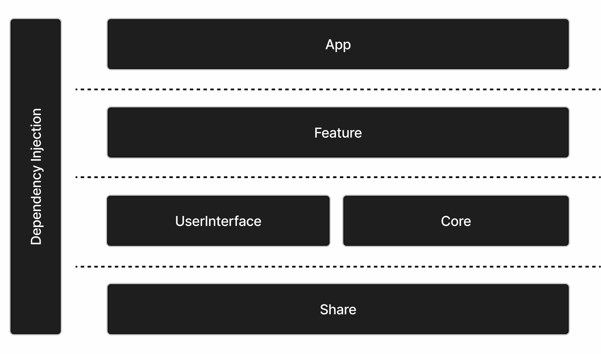
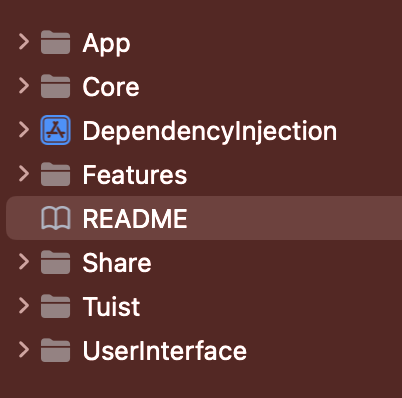
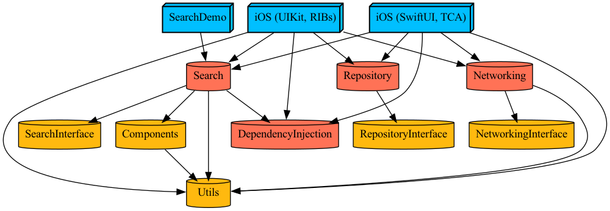
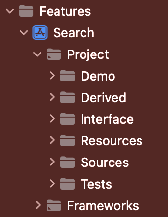
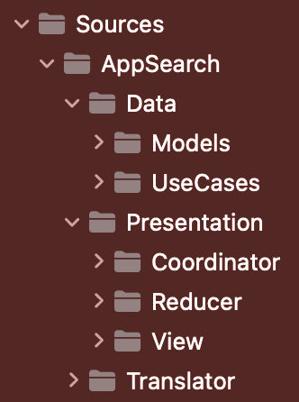
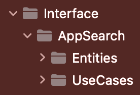

# AppStore

안녕하세요, 반갑습니다!

프로젝트 구조설명에 대한 내용이라 딱딱한 느낌보다는 구어체를 사용해 작성해 보았습니다! 😁

애플에 입사해서 앱 스토어를 밑바닥부터 설계해본다는 느낌으로 제작해보았어요

## 설치 및 실행 방법

1. CLI환경에서 다음 명령어를 입력하여 [Tuist🕺](https://github.com/tuist/tuist#whats-tuist-)를 설치해요
```bash
curl -Ls https://install.tuist.io | bash
```

2. 프로젝트 루트 디렉토리에서 다음 명령어를 입력하여 프로젝트를 빌드하고 실행해요
```bash
tuist fetch
```

```bash
tuist generate
```

## 아키텍처 및 모듈 소개

아키텍처는 µFeature아키텍처를 적용했고, 모델 내부의 설계는 최대한 CleanArchitecture의 구조와 유사하도록 설계하였어요

먼저, 전반적인 아키텍쳐 구성이에요 

<p>
    
    
</p>

여기 왼쪽에 보이는 각 계층(Layer)은 오른쪽의 프로젝트의 파일(Directory)로 구성하였어요 계층 구성은 아래에서 설명할 전체 모듈 구성도와 상관관계에 있어요

- App - App의 시작점인 `@main`및 App타겟이 모여있어요
- Feature - Search, SearchInterface등 도메인에 해당하는 타겟이 이 계층에 모여있어요 피처 모델은 App타겟을 가지고 있어 개별 빌드가 가능해요
- Core - Networking, Repository와 같이 외부의 영역과 소통하는 타겟이 이 계층에 모여있어요
- UserInterface - Components처럼 UI구성에 도움을 주는 타겟이 이 계층에 모여있어요 
- Share - 프로젝트의 가장 로우레벨(LowLevel)에 해당하는 계층으로 `Logger`, `Extension`등 프로젝트 유틸리티성을 가진것들이 모여있어요

다음으로, 현재 프로젝트의 전체 타겟 구성도(의존성 그래프)에요 



여기서 보이는 각 모듈의 명칭부터 소개하자면 최 상단에 보이는 파란색 박스는 App으로 각각 빌드 할 수 있으며 하위 모듈을 빌드할때 포함해요

중간계층에 보이는 모든 빨간색의 모듈은 구현체(Implementation)라고 해요 빨간색으로 보이는 이유는 정적(Static)환경으로 설정하였기 때문이에요 예외로 의존성 주입(DI, Dependency Injection) 모듈도 포함되었는데 공통적인 기능을 제공하는 모듈이다보니 구현체간의 의존성을 최소화하기 위해서 정적환경으로 설정하였어요

하단에 보이는 노란색의 모듈들은 인터페이스(Interface) 및 컴포넌트(Component)랍니다!

이제 프로젝트의 전체적인 구조를 보았으니 각 모듈 내부의 구현을 소개할게요

UI의존이 있는 모듈의 경우 디렉토리 구성은 클린 아키텍처 구성과 [TCA(TheComposableArchitecture)](https://github.com/pointfreeco/swift-composable-architecture#the-composable-architecture) 그리고 화면 전환을 위한 [TCACoordinator](https://github.com/johnpatrickmorgan/TCACoordinators)로 구성되어있어요

다음 이미지는 UI의존이 있는 Feature 모듈인 Search 모듈의 구조에요

<p>
    
    
    
</p>

*왼쪽부터 상위 디렉토리 Features의 하위 디렉토리 Sources와 Interface*

이 구조에서 Tuist가 자동으로 생성해준 부수적인 파일을 제외하고 구조적 의미가 있는 디렉토리에 대해서 이야기 할게요

- Demo - Feature모델은 앞서 말했듯이 각각 피처별로 개별 빌드가 가능하기 때문에 App타겟이 여기에 있어요
- Interface - 해당 Feature의 도메인 모델로 어떤 모델과도 의존하지 않은 독립적인 인터페이스가 여기에 있어요
    - Entities - 핵심 비즈니스 로직을 담당하는 객체가 여기에 있어요
    - UseCase - Entity를 사용해 도메인의 특정한 기능을 수행하는 객체가 여기에 있어요
- Sources - 구조에서 가장 많은 내용이 있는 디렉토리에요 
    - Data - 해당 Feature의 도메인 모델의 실질적인 구현(Impl)을 담당해요
        - Models - 데이터를 전달할 때 사용되는 DTO(Data Transfer Objects)가 여기에 있어요
        - UseCases - 도메인 UseCase의 실질적인 구현이 여기에 있어요
    - Presentation - 해당 Feature의 UI를 담당해요
        - Coordinator - 화면을 이동할 때 사용되는 Coordinator가 여기에 있어요
        - Reducer - View와 상호 작용하고 기능의 상태를 담당하는 모든 로직이 여기에 있어요
        - View - 기능의 모든 사용자 인터페이스 구성이 여기에 있어요
    - Translator - Domain영역에서의 Entitiy를 Presentation영역에서 사용할 수 있도록 데이터를 변환해주는 Mapper가 여기에 있어요
- Test - 프로젝트의 테스트를 진행하는 코드들이 여기에 있어요

해당 구조를 Tree형태로 나타내 볼게요
```
Features
└── Search
    ├── Demo
    │   ├── Interface
    │   ├── Sources
    │   └── Tests
    ├── Interface
    │   └── AppSearch
    │       ├── Entities
    │       └── UseCases
    ├── Sources
    │   └── AppSearch
    │       ├── Data
    │       │   ├── Models
    │       │   └── UseCases
    │       ├── Presentation
    │       │   ├── Coordinator
    │       │   │   ├── Reducer
    │       │   │   └── View
    │       │   ├── Reducer
    │       │   └── View
    │       │       ├── SearchDetail
    │       │       └── SearchView
    │       └── Translator
    └── Test요
```
여기까지가 프로젝트의 전반적인 프로젝트의 구성이였어요, 다음은 프로젝트에 사용된 라이브러리와 프레임워크에요

| 라이브러리 / 프레임워크 | 설명 |
| ---------------------- | ---- |
| SwiftUI                | 사용자 인터페이스를 구성하기 위한 애플의 선언적 프레임워크에요 |
| Tuist                  | 프로젝트 구조를 관리하고, 프로젝트를 생성하고 설정하는 데 사용되는 CLI에요 |
| ComposableArchitecture | 상태 관리 및 로직을 위한 반응형 프레임워크에요 |
| TCACoordinators        | 화면 전환 및 네비게이션을 관리하는 데 도움이 되는 프레임워크로, Composable Architecture와 함께 사용되요 |
| URLRouter              | URL 엔드포인트를 관리하는데 사용되는 라이브러리에요 |

마지막으로, xcov를 활용한 프레임워크별 테스트 커버리지에요
```
+-----------------------------------+---------+
|            xcov Coverage Report             |
+-----------------------------------+---------+
| AppStore.app                      | 60.51%  |
| CasePaths.framework               | 43.45%  |
| CombineSchedulers.framework       | 31.66%  |
| Components.framework              | 0.00%   |
| ComposableArchitecture.framework  | 25.69%  |
| CustomDump.framework              | 22.99%  |
| Dependencies.framework            | 39.79%  |
| DependencyInjection.framework     | 100.00% |
| FlowStacks.framework              | 30.32%  |
| IdentifiedCollections.framework   | 0.00%   |
| Networking.framework              | 61.74%  |
| NetworkingInterface.framework     | 100.00% |
| OrderedCollections.framework      | 0.00%   |
| Repository.framework              | 91.43%  |
| Search.framework                  | 32.52%  |
| SearchDemo.app                    | 0.00%   |
| SearchInterface.framework         | 100.00% |
| TCACoordinators.framework         | 56.15%  |
| URLRouter.framework               | 48.06%  |
| Utils.framework                   | 45.02%  |
| XCTestDynamicOverlay.framework    | 6.17%   |
| _SwiftUINavigationState.framework | 0.00%   |
| Average Coverage                  | 40.70%  |
+-----------------------------------+---------+
```
